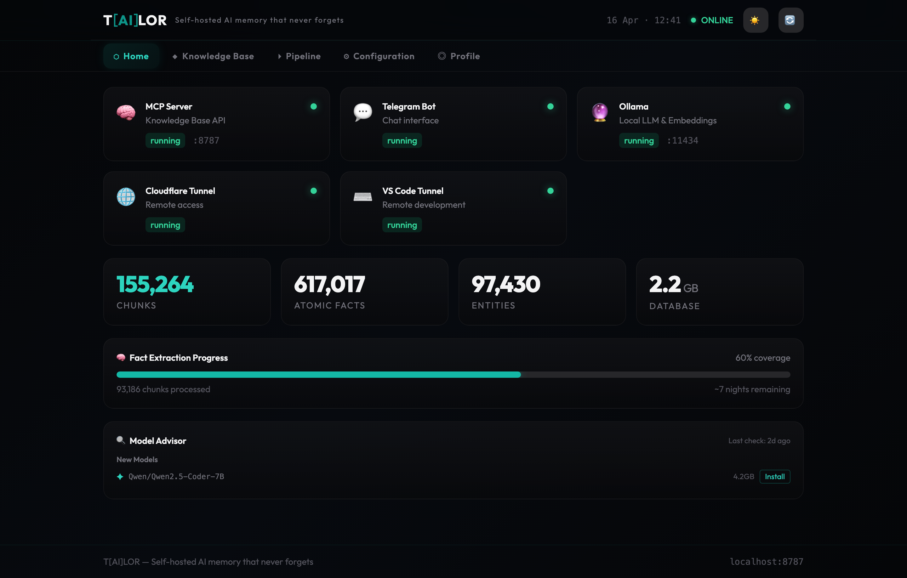
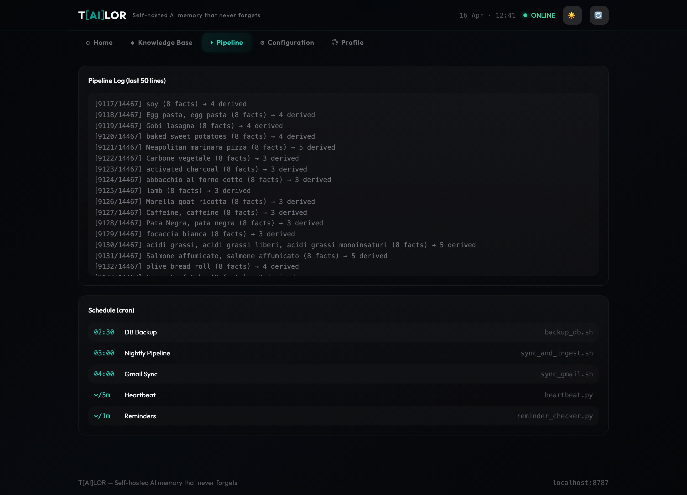

<p align="center">
  
</p>

<p align="center">
  <strong>Self-hosted AI memory that never forgets</strong><br/>
  LLM-agnostic personal knowledge base with persistent memory.
</p>

<p align="center">
  <a href="https://tailormemory.ai">Website</a> ·
  <a href="#quick-start">Quick Start</a> ·
  <a href="#features">Features</a> ·
  <a href="#architecture">Architecture</a> ·
  <a href="#configuration">Configuration</a> ·
  <a href="#mcp-tools">MCP Tools</a>
</p>

<p align="center">
  <a href="https://tailormemory.ai"></a>
  
  
  
  
</p>

---

AI assistants forget everything between sessions. TAILOR fixes that.

Your conversations, documents, emails, and decisions — indexed, searchable, and available to **any** AI assistant through the [Model Context Protocol](https://modelcontextprotocol.io). Runs on your hardware. Your data never leaves your machine.

|  |  |
|---|---|
| 🧠 **Persistent Memory** | Facts, decisions, and preferences survive across sessions and across different AI providers. |
| 🔒 **100% Local** | ChromaDB + Ollama. No cloud dependency for core functions. Your data stays on your machine. |
| 🔌 **LLM-Agnostic** | Anthropic, OpenAI, Google, Ollama. Switch providers by changing one line in the config. |
| 🤖 **MCP Native** | 21 tools. Connects to Claude, ChatGPT, and any MCP-compatible client. |
| 🔄 **Self-Enriching** | Nightly pipelines extract atomic facts, build entity graphs, derive inferences, supersede outdated info. |
| 📱 **Telegram Bot** | Full conversational interface with KB access, reminders, and automatic session capture. |

---

## Screenshots

<p align="center">
  
  <br/><em>Home — services health, KB stats, fact extraction progress, Model Advisor suggestions.</em>
</p>

<p align="center">
  
  <br/><em>Pipeline — live enrichment log and cron schedule.</em>
</p>

---

## Running in Production

TAILOR is not a proof of concept. It is battle-tested on real, daily workload:

| Metric | Value |
|---|---|
| **Chunks indexed** | 155,265 |
| **Atomic facts extracted** | 617,017 |
| **Entities tracked** | 97,430 |
| **Conversations ingested** | 37,016 (ChatGPT + Claude + documents + email) |
| **Fact supersession events** | 753 (obsolete facts auto-marked) |
| **Hardware** | Mac Mini M4 · 24 GB RAM · 460 GB SSD |
| **Uptime** | 24/7, LaunchDaemon-managed |
| **Nightly enrichment** | 3:00 AM — automated, Telegram-reported |

All data lives on one self-hosted machine. No cloud, no subscription, no data sharing.

---

## Quick Start

### Requirements

- **macOS** or **Linux** (Windows is not currently supported)
- Python 3.11+
- [Ollama](https://ollama.com) (for local embeddings)
- At least one LLM API key (Anthropic, OpenAI, or Google) — or Ollama for fully local operation

### Install

```bash
git clone https://github.com/tailormemory/tailor.git
cd tailor
chmod +x setup.sh && ./setup.sh
```

The setup script creates the virtual environment, installs dependencies,
pulls the Ollama embedding model, and downloads the reranker.

### Run

```bash
.venv/bin/python3 mcp_server.py
```

Open `http://localhost:8787/dashboard` → the **Setup Wizard** walks you through configuration
(LLM provider, embedding, Telegram, cloud sync, and more).

To run as a background service, see [`install/README.md`](install/README.md).

### Connect to an AI Assistant

Add TAILOR as an MCP connector in Claude, ChatGPT, or any MCP-compatible client:

```
URL: http://localhost:8787/mcp
```

For remote access, set up a tunnel (Cloudflare, Tailscale, or ngrok) and use the public URL with a token:

```
URL: https://your-domain.com/mcp?token=YOUR_TAILOR_API_KEY
```

Set the `TAILOR_API_KEY` environment variable to enable authentication for remote access.
Without it, the server runs open (suitable for local-only use).

---

## Features

### 🧠 Knowledge Base

| Capability | Description |
|---|---|
| **Hybrid Search** | Semantic similarity + entity matching + keyword lookup in one query |
| **ONNX Re-ranking** | Cross-encoder re-ranker for result quality (~28ms/query on consumer hardware) |
| **Atomic Facts** | LLM-powered extraction of discrete facts from every chunk |
| **Fact Supersession** | Automatically detects and marks outdated facts when new info arrives |
| **Fact Derivation** | Infers second-order facts from entity clusters |
| **Temporal Grounding** | Dual-layer `document_date` + `event_date` for time-aware retrieval |
| **User Profiles** | Auto-generated static + dynamic profile, refreshed nightly |
| **Rate Limiting** | IP-based throttling on failed auth attempts. Configurable max attempts, window, and ban duration. |
| **Multi-Token Auth** | Per-token permissions (read/write/full). Give ChatGPT read-only access, Claude write access, keep admin full. |
| **Live Capture** | Chrome extension captures conversations from Claude, ChatGPT, and Gemini in real-time. |
| **Model Advisor** | Scans HuggingFace + cloud APIs for models matching your hardware. One-click install from the dashboard. |

### 📥 Multi-Source Ingest

| Source | Method |
|---|---|
| **Documents** | PDF, Excel, CSV, Word, PowerPoint — recursive folder scan |
| **Email** | Gmail (OAuth2) or any IMAP provider — see [`docs/EMAIL_SETUP.md`](docs/EMAIL_SETUP.md) |
| **ChatGPT** | Export parser (conversations.json) |
| **Claude** | Export parser (conversations.json + projects) |
| **Gemini** | Google Takeout parser (JSON) |
| **Cloud Storage** | OneDrive, Google Drive, Dropbox via rclone |
| **Browser Upload** | Drag-and-drop from the dashboard with progress tracking |
| **Telegram** | Automatic real-time session capture |

### 🤖 LLM Integration

- **4 providers**: Anthropic · OpenAI · Google · Ollama
- **Config-driven**: every enrichment role (fact extraction, supersession, derivation, entities, summaries) reads its backends from `config/tailor.yaml` — no hardcoded providers
- **Multi-backend rotation**: each role supports an ordered list of backends; if one hits a rate limit, the script automatically falls back to the next. Mix cloud and local models freely
- **Tier 1** (tool use): LLM decides which KB tools to call autonomously
- **Tier 2** (prompt-based): pre-fetched context injected into prompt for local models
- **Proactive memory**: LLMs save important facts and session summaries without being asked

### 🖥️ Web Dashboard

- Real-time KB stats, service health monitoring, pipeline logs
- **Setup Wizard**: 10-step guided configuration for first-time setup
- **Config Editor**: edit all settings live from the browser
- **Upload**: drag-and-drop conversation imports (ChatGPT, Claude, Gemini) with background processing
- **Zero external dependencies**: React, Tailwind, and all assets served locally — no CDN, no build step
- Dark/light mode, frosted glass navbar, responsive mobile layout

### 🗨️ Native Chat

- First-party web chat built into the dashboard (**Chat** tab, or standalone at `/dashboard/chat.html`)
- Server-sent events stream the model's tokens as they are generated
- Real streaming on Anthropic (the default provider); word-chunked fallback on OpenAI, Google, and Ollama
- Tool calls (KB search, fact lookup, `system_status`) surface inline as "⟳ searching memory…" / "✓ searched memory (Nms)" pills
- Persistent sessions in SQLite (`db/chat_sessions.sqlite3`): list, rename, resume, delete
- Markdown rendering via `marked` + `DOMPurify` (loaded from CDN; vendor them locally for fully offline-first setups)
- Auth: reuses the dashboard cookie session — no separate login, single-user
- Configurable under `chat_interface:` in `config/tailor.yaml` (enable/disable, history window, keepalive interval, empty-state suggestions, optional dedicated system prompt)

### 💬 Telegram Bot

- Claude/GPT as conversation brain with full KB access
- Local intent classification via Ollama
- Natural language reminders with recurring schedules
- Automatic session capture on conversation timeout
- System status queries: KB stats, pipeline progress, fact extraction coverage, service health
- Multi-language support via AI-powered i18n

---

## Architecture

```
┌─────────────┐  ┌─────────────┐  ┌─────────────┐
│  Claude.ai  │  │   ChatGPT   │  │  Telegram   │
│ (MCP client)│  │ (MCP client)│  │   (bot)     │
└──────┬──────┘  └──────┬──────┘  └──────┬──────┘
       └────────────┬───┘────────────────┘
                    │
               MCP Protocol
                    │
         ┌──────────┴──────────┐
         │  TAILOR MCP Server  │
         │     (port 8787)     │
         │  21 tools · API     │
         │  Dashboard · Auth   │
         └──────────┬──────────┘
                    │
    ┌───────────────┼───────────────┐
    │               │               │
┌───┴────┐   ┌─────┴─────┐   ┌─────┴─────┐
│ChromaDB│   │ Facts DB  │   │  Entity   │
│Vectors │   │ (SQLite)  │   │  Index    │
└────────┘   └───────────┘   └───────────┘
```

### Data Flow

```
Sources → Ingest → Chunk → Embed → ChromaDB
                                      ↓
                              Nightly Enrichment
                                      ↓
                    Facts → Entities → Derives → Profiles
                                      ↓
                              Hybrid Search + Reranking
                                      ↓
                           MCP Tools → LLM Response
```

---

## Configuration

All config lives in `config/tailor.yaml`:

| Section | Purpose |
|---|---|
| `user` | Your name, bio, name variants, language |
| `llm` | Primary LLM (provider, model, API key) |
| `classifier` | Intent classifier for Telegram bot |
| `embedding` | Embedding provider and model |
| `enrichment` | Per-role ordered list of LLM backends for nightly enrichment (fact extraction, supersession, derivation, entities, summaries). Supports automatic rate-limit rotation. |
| `telegram` | Bot token and chat ID |
| `ingest` | Document paths, conversation sources |
| `cloud_sync` | rclone remotes for cloud storage |
| `email` | Email sync provider (IMAP or Gmail API) |
| `services` | Services monitored by heartbeat |
| `auth` | Rate limiting and multi-token authentication |
| `pipeline` | Nightly pipeline schedule and timeouts |
| `model_advisor` | Model discovery frequency, hardware specs, tracked providers |
| `user.language` | Language for AI-generated content |

Example enrichment config with multi-backend rotation:

```yaml
enrichment:
  fact_extraction:
    backends:
      - provider: google
        model: gemini-2.5-flash
      - provider: openai
        model: gpt-4o-mini
      - provider: anthropic
        model: claude-haiku-4-5-20251001
    daily_limit_per_backend: 4500
  summaries:
    backends:
      - provider: ollama
        model: qwen2.5:7b
```

See [`config/tailor.yaml.example`](config/tailor.yaml.example) for the full template with all roles and options.

---

## MCP Tools

| Tool | Description |
|---|---|
| `search` | Semantic search across the entire KB |
| `kb_search` | Hybrid search (semantic + entity + reranker) |
| `kb_hybrid_search` | Combined semantic + entity search in one query |
| `kb_search_by_entity` | Find all chunks mentioning a specific entity |
| `kb_search_by_topic` | Search by conversation title |
| `kb_search_docs` | Search only document sources |
| `kb_query_advanced` | Advanced KB query with source, date, and sort filters |
| `kb_list_conversations` | List conversations stored in the KB |
| `kb_add` | Save a fact, decision, or preference |
| `kb_update_session` | Save a structured session summary |
| `kb_stats` | Knowledge base statistics |
| `get_user_profile` | Auto-generated user profile (static + dynamic) |
| `update_profile` | Update profile with new facts |
| `fetch` | Retrieve a specific chunk by ID |
| `create_reminder` | One-time or recurring reminders |
| `delete_reminder` | Delete a reminder by ID |
| `list_reminders` | List active reminders |
| `send_telegram` | Send a Telegram message to the user |
| `exec_command` | Run a shell command on the host machine |
| `read_file` | Read a file from the host filesystem |
| `write_file` | Write or update a file on the host filesystem |

---

## REST API

The MCP server also exposes a REST API used by the dashboard and available for integrations:

| Endpoint | Auth | Description |
|---|---|---|
| `GET /dashboard` | Public | Dashboard HTML |
| `GET /dashboard/*` | Public | Static assets (JS, icons, images) |
| `POST /api/auth/login` | Public | Authenticate with token → session cookie |
| `GET /api/auth/check` | Cookie/Token | Verify session |
| `GET /api/dashboard/setup` | Public | Check if config exists (first-run detection) |
| `GET /api/dashboard/bulk` | Cookie/Token/Localhost | All dashboard data in a single call (stats, services, config, profile, pipeline) |
| `GET /api/dashboard/stats` | Cookie/Token/Localhost | KB statistics |
| `GET /api/dashboard/services` | Cookie/Token/Localhost | Service health status |
| `GET /api/dashboard/config` | Cookie/Token/Localhost | Sanitized config (no API keys) |
| `POST /api/dashboard/config/save` | Cookie/Token/Localhost | Update config sections |
| `GET /api/dashboard/profile` | Cookie/Token/Localhost | User profile JSON |
| `GET /api/dashboard/pipeline` | Cookie/Token/Localhost | Pipeline logs |
| `POST /api/dashboard/upload` | Cookie/Token/Localhost | Upload conversation exports |
| `GET /api/dashboard/upload/status` | Cookie/Token/Localhost | Upload job progress |
| `GET /api/dashboard/model-advisor` | Cookie/Token/Localhost | Model recommendations and advisories |
| `POST /api/dashboard/model-advisor/install` | Cookie/Token/Localhost | Install Ollama model (background pull) |
| `GET /api/dashboard/model-advisor/status/{id}` | Cookie/Token/Localhost | Install job status |
| `POST /api/ingest-live` | Cookie/Token/Localhost | Live conversation ingest from Chrome extension |
| `GET /api/dashboard/rate-limit` | Cookie/Token/Localhost | Auth rate limiting statistics |
| `GET /api/fetch/<id>` | Localhost only | Fetch a chunk by ID |
| `GET /api/search?q=` | Localhost only | Semantic search |

Authentication: remote calls require a valid `TAILOR_API_KEY` via Bearer token, query parameter, or session cookie. Localhost calls bypass auth.

---

## Nightly Pipeline

Automated enrichment runs every night:

| Time | Job | Description |
|---|---|---|
| 02:30 | **Backup** | SQLite databases |
> **Important**: Set `TAILOR_HOME` in your crontab so the pipeline resolves paths correctly:
> ```
> TAILOR_HOME=/path/to/tailor
> 0 3 * * * cd /path/to/tailor && ./sync_and_ingest.sh
> ```

| 03:00 | **Pipeline** | Cloud sync → doc ingest → entities → facts → supersession → derivation → profile |
| 04:00 | **Email** | Gmail/IMAP export → triage → chunk → ingest |

Safety features: ChromaDB integrity check before any write operation, graceful SIGTERM with 15s grace period (no `kill -9`), automatic restore from backup on corruption, Telegram alerts on failure.

Pipeline notifications via Telegram on completion or error (if Telegram bot is configured).

---

## Project Structure

```
tailor/
├── mcp_server.py              # MCP server + REST API + dashboard serving
├── setup.sh                   # One-command installer
├── sync_and_ingest.sh         # Nightly pipeline
├── sync_email.sh              # Email sync (Gmail or IMAP)
├── install/                   # Service templates (macOS plist, Linux systemd)
├── config/
│   ├── tailor.yaml            # Your config (git-ignored)
│   └── tailor.yaml.example    # Template
├── dashboard/
│   ├── index.html             # React dashboard (single-file, no build step)
│   ├── logo.svg               # T[AI]LOR logo
│   ├── vendor/                # React, ReactDOM, Tailwind (served locally)
│   └── icons/                 # ChatGPT, Claude, Gemini favicons
├── scripts/
│   ├── lib/                   # Config, embedding, LLM client, i18n, session store
│   ├── ingest/                # Conversation parsers, doc ingest, semantic chunker, upload worker
│   ├── gmail/                 # Gmail/IMAP export, triage, chunk, ingest
│   ├── enrichment/            # Fact extraction, supersession, derivation, entities, profiles
│   ├── services/              # Telegram bot, heartbeat, reminders
│   └── maintenance/           # Backup, rebuild, pre-launch audit
├── db/                        # ChromaDB, facts.sqlite3, entity_index.sqlite3 (git-ignored)
├── models/reranker/           # ONNX cross-encoder (git-ignored, downloaded by setup.sh)
├── extension/                 # Chrome extension for live conversation capture
├── docs/                      # EMAIL_SETUP.md and other guides
└── requirements.txt
```

---

## Chrome Extension — Live Conversation Capture

TAILOR includes a Chrome extension that captures conversations from Claude, ChatGPT, and Gemini in real-time and sends them to your KB automatically.

### Install

1. Open `chrome://extensions/` in Chrome
2. Enable **Developer mode** (toggle top-right)
3. Click **Load unpacked** and select the `extension/` folder from this repo
4. Click the extension icon → enter your TAILOR server URL and API token
5. Enable **Capture enabled**

The extension shows a small teal badge on supported sites when active.

### How it works

- Observes the page DOM for new messages (MutationObserver)
- Buffers and sends new messages to `/api/ingest-live` every 30 seconds
- Deduplicates by content hash — same conversation won't be ingested twice
- Works on: **claude.ai**, **chatgpt.com**, **gemini.google.com**
- Mobile conversations sync automatically (they appear when you open the web version)

### Permissions

| Permission | Why |
|---|---|
| `storage` | Save your server URL and token locally |
| `activeTab` | Read conversation content on the current tab |
| Host access to claude.ai, chatgpt.com, gemini.google.com | Inject the capture script on these sites only |

No data is sent to any third party. Everything goes directly to your self-hosted TAILOR instance.

---

## Deployment

### Background Service

Templates for macOS (LaunchDaemon) and Linux (systemd) are in the `install/` directory.
See [`install/README.md`](install/README.md) for step-by-step instructions.

```bash
# macOS
sudo cp install/com.tailor.mcp.plist.example /Library/LaunchDaemons/com.tailor.mcp.plist
# edit paths and API keys, then:
sudo launchctl bootstrap system /Library/LaunchDaemons/com.tailor.mcp.plist

# Linux
sudo cp install/tailor-mcp.service.example /etc/systemd/system/tailor-mcp.service
# edit paths, user, and API keys, then:
sudo systemctl enable --now tailor-mcp
```

### Remote Access

- **Cloudflare Tunnel** (recommended) — free, no open ports
- **Tailscale** — mesh VPN, simplest setup
- **ngrok** — quick testing

### Connecting ChatGPT

ChatGPT connects via MCP in Developer Mode. For proactive memory, add to ChatGPT's Custom Instructions:

```
When the TAILOR MCP connector is active, use kb_add to save important facts
and kb_update_session at end of significant conversations. Set source="chatgpt".
```

---

## Privacy & Security

- **All data stored locally** — no cloud dependencies for core functions
- **API keys in system config** (LaunchDaemon/systemd env vars), never in code
- **Dashboard auth** via TAILOR_API_KEY token or cookie session
- **Remote access** secured via Cloudflare Zero Trust, Tailscale, or token auth
- **`.gitignore`** excludes all personal data, credentials, databases, and config
- **Pre-launch audit**: run `python3 scripts/maintenance/audit_opensource.py` to verify no secrets, personal references, or broken imports before pushing

---

## vs. Supermemory

TAILOR and [Supermemory](https://supermemory.ai) solve the same problem from opposite directions:

| | Supermemory | TAILOR |
|---|---|---|
| **Hosting** | Cloud-first | 100% self-hosted |
| **Privacy** | Data on their servers | Data on your machine |
| **LLM support** | Their stack | Any provider (4 built-in) |
| **Tool use** | 3 fixed tools | 21 autonomous tools |
| **Enrichment** | Fixed pipeline | Config-driven, ordered multi-backend with automatic rotation |
| **Cost** | Subscription | Free (your hardware + API keys) |
| **Setup** | npm install | git clone + config |

Both have: atomic facts, supersession, user profiles, hybrid search, temporal grounding, session capture.

---

## Roadmap

- **Native Chat Interface** — Built-in conversational UI at `/chat` in the dashboard. Talk to TAILOR directly without Claude, ChatGPT, or Telegram. Text-first, with optional voice input/output via browser APIs.
- **Chrome Web Store** — Publish the browser extension for one-click install (submitted, pending review).
- **Model Advisor v2** — Benchmark comparison, automatic backend suggestions when a faster/cheaper model fits the same enrichment role.
- **Auto-forgetting** — Configurable TTL for facts, with automatic expiration and cleanup.
- **Webhook real-time ingest** — Push-based ingestion for live data sources (vs. nightly batch).
- **Multimodal support** — Video, audio, and code AST ingestion.

---

## License

[Apache 2.0](LICENSE)

---

<p align="center">
  <strong>Give your AI a memory. Keep it on your machine.</strong>
</p>
